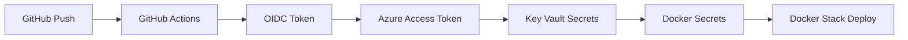

# 🔐 Guia de Configuração - GitHub OIDC + Azure Key Vault

Este documento descreve como configurar o GitHub OIDC para acesso seguro ao Azure Key Vault sem usar Azure CLI.

## 📋 Pré-requisitos

### 1. Azure Service Principal com OIDC

Configure um Service Principal no Azure com federação OIDC:

```bash
# 1. Criar Service Principal
az ad sp create-for-rbac --name "GitHub-OIDC-ConexaoDeSorte-Redis" --role contributor --scopes /subscriptions/{subscription-id}

# 2. Configurar federação OIDC
az ad app federated-credential create \
    --id {app-id} \
    --parameters '{
        "name": "GitHub-ConexaoDeSorte-Redis",
        "issuer": "https://token.actions.githubusercontent.com",
        "subject": "repo:Wibson82/conexao-de-sorte-redis-infraestrutura:ref:refs/heads/main",
        "audiences": ["api://AzureADTokenExchange"]
    }'
```

### 2. Permissões do Key Vault

Configure as permissões do Service Principal no Key Vault:

```bash
# Dar permissões de leitura de secrets
az keyvault set-policy \
    --name {vault-name} \
    --spn {service-principal-id} \
    --secret-permissions get list
```

### 3. Secrets no GitHub Repository

Configure os seguintes secrets no repositório GitHub:

```
AZURE_CLIENT_ID=<service-principal-client-id>
AZURE_TENANT_ID=<azure-tenant-id>
AZURE_SUBSCRIPTION_ID=<azure-subscription-id>
AZURE_KEYVAULT_NAME=<vault-name>
```

## 🔑 Secrets Necessários no Azure Key Vault

### Redis Infrastructure
```
conexao-de-sorte-redis-password          # Senha do Redis (obrigatório)
conexao-de-sorte-redis-host              # Host do Redis (opcional, padrão: 0.0.0.0)
conexao-de-sorte-redis-port              # Porta do Redis (opcional, padrão: 6379)
conexao-de-sorte-redis-database          # Database do Redis (opcional, padrão: 0)
```

### Database Infrastructure (para outros microserviços)
```
conexao-de-sorte-database-host           # Host do MySQL
conexao-de-sorte-database-port           # Porta do MySQL
conexao-de-sorte-database-username       # Usuário do MySQL
conexao-de-sorte-database-password       # Senha do MySQL
conexao-de-sorte-database-proxysql-password  # Senha do ProxySQL
conexao-de-sorte-database-jdbc-url       # URL JDBC completa
conexao-de-sorte-database-r2dbc-url      # URL R2DBC completa
conexao-de-sorte-database-url            # URL genérica do banco
conexao-de-sorte-db-host                 # Host alternativo
conexao-de-sorte-db-port                 # Porta alternativa
conexao-de-sorte-db-username             # Usuário alternativo
conexao-de-sorte-db-password             # Senha alternativa
```

## 🚀 Como Funciona o Pipeline

### 1. Processo de Deploy



### 2. Steps do Pipeline

1. **Validação**: Verifica sintaxe dos arquivos
2. **Segurança**: Scan de vulnerabilidades
3. **Sync Secrets**: Obtém secrets do Key Vault via OIDC
4. **Validação**: Verifica se secrets foram criados
5. **Deploy**: Deploy da stack Docker
6. **Health Check**: Verifica se serviços estão funcionando

## 🛠️ Scripts Disponíveis

### Sincronização de Secrets
```bash
# Sincronizar todos os secrets do Key Vault
./.github/workflows/scripts/sync-azure-keyvault-secrets.sh kv-conexao-de-sorte production
```

### Validação de Secrets
```bash
# Validar se todos os secrets estão criados
./.github/workflows/scripts/validate-docker-secrets.sh --verbose
```

### Limpeza de Secrets
```bash
# Remover todos os secrets do projeto
./.github/workflows/scripts/cleanup-docker-secrets.sh

# Forçar remoção (mesmo se em uso)
./.github/workflows/scripts/cleanup-docker-secrets.sh --force
```

## 🔍 Troubleshooting

### Problema: Token OIDC inválido
```bash
# Verificar configuração do federated credential
az ad app federated-credential list --id {app-id}
```

### Problema: Acesso negado ao Key Vault
```bash
# Verificar permissões
az keyvault show --name {vault-name} --query "properties.accessPolicies"
```

### Problema: Secret não encontrado
```bash
# Listar secrets no Key Vault
az keyvault secret list --vault-name {vault-name} --query "[].name"

# Verificar secret específico
az keyvault secret show --name "conexao-de-sorte-redis-password" --vault-name {vault-name}
```

### Problema: Docker Secret não criado
```bash
# Verificar Docker Swarm
docker info | grep "Swarm: active"

# Listar secrets Docker
docker secret ls

# Verificar logs do script
docker service logs {stack-name}_redis
```

## 📝 Notas Importantes

1. **Sem Azure CLI**: O pipeline não usa `az` commands, apenas REST API direta
2. **OIDC Only**: Autenticação feita exclusivamente via GitHub OIDC
3. **Zero Secrets**: Nenhum secret permanente armazenado no GitHub
4. **Failover**: Scripts têm retry automático e tratamento de erros
5. **Validação**: Validação automática de todos os secrets criados

## 🔒 Segurança

- ✅ Tokens temporários (válidos por 1 hora)
- ✅ Acesso baseado em identidade federada
- ✅ Princípio do menor privilégio
- ✅ Auditoria completa no Azure AD
- ✅ Secrets nunca expostos em logs
- ✅ Rotação automática de tokens

## 📞 Suporte

Em caso de problemas:

1. Verificar logs do GitHub Actions
2. Verificar configuração OIDC no Azure
3. Validar permissões do Key Vault
4. Executar scripts de validação localmente
5. Verificar conectividade de rede do runner